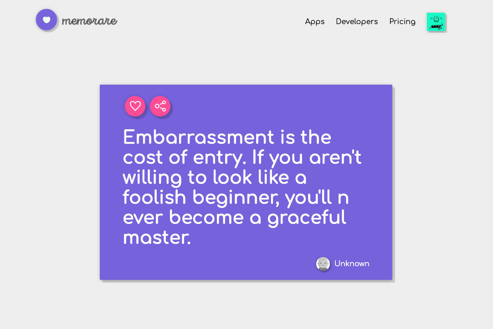

> ⚠️ The project has migrated to https://github.com/memorare/app

<p align="middle">
  
</p>

<h1 align="middle">memorare.app</h1>

<p align="middle">Explore the greatest quotes of History.</p>

<p align="middle">
  
</p>

# Quickstart

1. Clone this project

```bash
git clone https://github.com/memorare/memorare.app
```

2. Install dependancies

```bash
yarn # or npm install
```

3. Run the project

```bash
yarn run dev # or npm run dev
```

4. Get you developer API key

In order the request quotes and other data, you will need to request a developer API key at [dev.memorare.app](https://dev.memorare.app).

# Contibute

You can freely contribute to this project by opening an issue, proposing a pull request (PR), or starting a discussion.

# Licence

Mozilla Public License 2.0.

Please read the [LICENSE](./LICENSE) for more information.

Please [ask](mailto:github@memorare.app) if you have any doubt.
