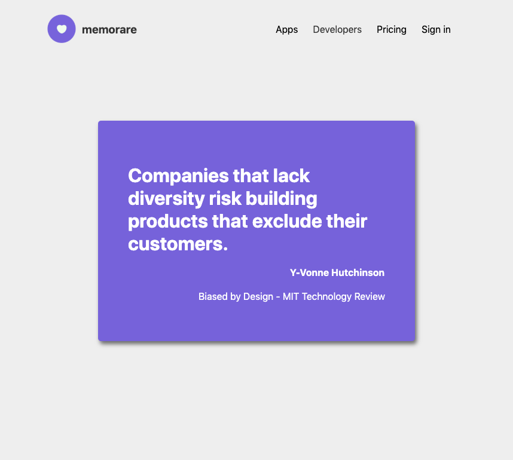

<p align="middle">
  
</p>

<h1 align="middle">memorare.app</h1>

<p align="middle">Read the quote of the day.</p>

<p align="middle">
  
</p>

## Quickstart

1. Clone this project

```bash
git clone https://github.com/memorare/memorare.app
```

2. Install dependancies

```bash
yarn # or npm install
```

3. Run the project

```bash
yarn run dev # or npm run dev
```

4. Get you developer API key

In order the request quotes and other data, you will need to request a developer API key at [dev.memorare.app](https://dev.memorare.app).

## Contibute

You can freely contribute to this project by opening an issue, proposing a pull request (PR), or starting a discussion.

## Licence

Custom licence. Please read the [LICENSE](./LICENSE) for more information.

Allowed:

* Install, Copy, Modify the program or source code
* Share the app or the source code with others
* Hack, Improve the software

NOT Allowed:

* Commercialize this app, this source code or a part of it under the same name [i.e. Memorare] or another brand name
* Copy a part of the source code into another paid software

Please [ask](mailto:jeremiecorpinot@outlook.com) if you have any doubt.
